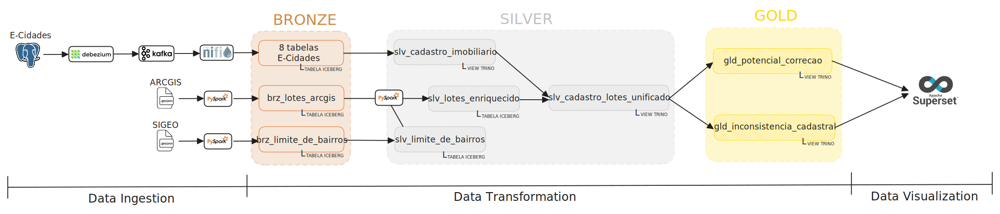

# Pipeline End-to-End da PoV – SEFAZ Niterói

Este documento descreve o fluxo completo de ingestão, transformação e exposição de dados da Prova de Valor (PoV) entre os sistemas **SIGEO** (geoespacial) e **E-Cidades** (tributário), conforme definido na arquitetura da Tecnisys Data Platform (TDP).

> ⏱️ **Meta da PoV**: demonstrar **integração near-real-time**, **enriquecimento cruzado**, **APIs seguras** e **dashboards com KPIs de valor**.

---

## 1. Visão Geral da Arquitetura

Abaixo está o diagrama de fluxo de dados da PoV, mostrando a integração entre as fontes (E-Cidades e SIGEO), as camadas do Lakehouse (Bronze → Silver → Gold) e a exposição final via Superset.

> ✅ **Arquitetura end-to-end**:
> - Ingestão near-real-time (CDC + API)
> - Processamento com PySpark e SQL
> - Modelagem analítica com Trino
> - Visualização com Superset

### 🖼️ Diagrama de Arquitetura

*(Imagem salva em `docs/architecture/arquitetura_pov_sefaz_niteroi.svg`)*

> 🔗 **Tecnologias envolvidas**:
> - **Ingestão**: Debezium, Kafka, NiFi, PySpark
> - **Armazenamento**: Iceberg (HDFS/S3)
> - **Processamento**: PySpark, Trino (SQL)
> - **Visualização**: Superset
> - **Governança**: Ranger, Atlas

## 2. Ingestão na Camada Bronze (Raw)

> ✅ **Pré-requisito**: Todas as tabelas bronze são criadas previamente via Trino com os scripts em [`/sql/bronze/`](sql/bronze/).

### 2.1. Fontes Batch – SIGEO

#### a) **Lotes (ArcGIS)**
- **Fonte**: API REST do SIGEO (Feature Service)
- **Job**: [`jobs/python/geo/lotes/job_geo_pull_lotes_arcgis.py`](jobs/python/geo/lotes/job_geo_pull_lotes_arcgis.py)  
  - Extrai lotes em formato GeoJSON
- **Transformação**: [`jobs/python/geo/lotes/job_geo_transform_lotes.py`](jobs/python/geo/lotes/job_geo_transform_lotes.py)  
  - Converte geometria e normaliza atributos
- **Carga Bronze**: [`jobs/python/geo/lotes/job_geo_load_lotes_bronze.py`](jobs/python/geo/lotes/job_geo_load_lotes_bronze.py)  
  - Tabela destino: `iceberg.sefaz_brz.brz_lotes_arcgis`

#### b) **Limite de Bairros**
- **Fonte**: Download manual do portal SIGEO (`limite_de_bairros.geojson`)
- **Transformação**: [`jobs/python/geo/limite_de_bairros/job_geo_transform_ldb.py`](jobs/python/geo/limite_de_bairros/job_geo_transform_ldb.py)  
- **Carga Bronze**: [`jobs/python/geo/limite_de_bairros/job_geo_load_ldb_bronze.py`](jobs/python/geo/limite_de_bairros/job_geo_load_ldb_bronze.py)  
  - Tabela destino: `iceberg.sefaz_brz.brz_limite_de_bairros`

---

### 2.2. Fonte Near Real-Time – E-Cidades (CDC)

- **Fonte**: PostgreSQL (`poc_ecidade_markway`) com 8 tabelas:  
  `iptubase`, `lote`, `iptuender`, `loteloc`, `carlote`, `carvalor`, `iptuconstr`, `iptucalv`
- **Captura de Mudanças**:  
  - Conector Debezium configurado via [`conf/debezium/kcnn_ecidades_cadastro_v1.json`](conf/debezium/kcnn_ecidades_cadastro_v1.json)  
  - Publica eventos em tópicos Kafka (ex: `ecidades.iptubase`)
- **Ingestão no Lake**:  
  - Job NiFi: [`jobs/nifi/bronze_kafka_to_iceberg_ingest_v1.xml`](jobs/nifi/bronze_kafka_to_iceberg_ingest_v1.xml)  
  *(Imagem completa do fluxo salva em [`jobs/nifi/bronze_kafka_to_iceberg_ingest_v1.PNG`](jobs/nifi/bronze_kafka_to_iceberg_ingest_v1.PNG)*
  - Valida e persiste mensagens em 8 tabelas bronze no Iceberg:  
    `iceberg.sefaz_brz.brz_iptubase`, `brz_lote`, ..., `brz_iptucalv`

> 🔁 **Latência alvo (KR1)**: P95 ≤ 5s desde o `COMMIT` no PostgreSQL até a disponibilidade no Lake.

---

## 3. Transformação na Camada Silver (Curated)

> ✅ **Pré-requisito**: Todas as tabelas silver são criadas previamente via Trino com os scripts em [`/sql/silver/`](sql/silver/).

### 3.1. Limite de Bairros
- **Script**: [`/sql/silver/create_slv_limite_de_bairros.sql`](sql/silver/create_slv_limite_de_bairros.sql)  
- Cria tabela `iceberg.sefaz_slv.slv_limite_de_bairros` a partir da bronze

### 3.2. Cadastro Imobiliário (E-Cidades unificado)
- **Script**: [`/sql/silver/create_slv_cadastro_imobiliario.sql`](sql/silver/create_slv_cadastro_imobiliario.sql)  
- Agrega as 8 tabelas bronze em uma única view lógica:  
  `iceberg.sefaz_slv.slv_cadastro_imobiliario`

### 3.3. Lotes Enriquecidos (SIGEO + Geometria)
- **Script DDL**: [`/sql/silver/create_slv_lotes_enriquecido.sql`](sql/silver/create_slv_lotes_enriquecido.sql)  
- **Job de Carga**: [`jobs/python/geo/lotes/job_geo_load_lotes_silver.py`](jobs/python/geo/lotes/job_geo_load_lotes_silver.py) (PySpark)  
  - Enriquece lotes com metadados espaciais, limpeza de coordenadas, etc.  
  - Saída: `iceberg.sefaz_slv.slv_lotes_enriquecido`

### 3.4. View Unificada (Geo + Tributário)
- **Script**: [`/sql/silver/create_slv_cadastro_lotes_unificado.sql`](sql/silver/create_slv_cadastro_lotes_unificado.sql)  
- Junta `slv_cadastro_imobiliario` + `slv_lotes_enriquecido` pela chave `tx_insct`  
- Resultado: `iceberg.sefaz_slv.slv_cadastro_lotes_unificado`

> **Chave de integração**: `tx_insct` (Inscrição Técnica do Lote)

---

## 4. Camada Gold (Business Value)

> Views analíticas prontas para consumo por dashboards e APIs.

### 4.1. Potencial de Correção de IPTU
- **Script**: [`/sql/gold/create_gld_potencial_correcao.sql`](sql/gold/create_gld_potencial_correcao.sql)  
- Calcula:
  - IPTU por m²
  - Comparação com média do loteamento
  - Ranking de oportunidades de revisão
- View: `iceberg.sefaz_gld.gld_potencial_correcao`

### 4.2. Índice de Inconsistência Cadastral (IIC)
- **Script**: [`/sql/gold/gld_inconsistencia_cadastral.sql`](sql/gold/gld_inconsistencia_cadastral.sql)  
- Identifica:
  - Registros com área construída nula/inconsistente
  - Lotes sem geolocalização
  - Divergências entre matrícula e geometria
- View: `iceberg.sefaz_gld.gld_inconsistencia_cadastral`

> 📊 **KPIs atendidos**:
> - **Receita Potencial de Correção** (KR2)
> - **Índice de Inconsistência Cadastral (IIC)** (KR2)

---

## 5. Visualização – Superset

> Dashboards alinhados aos **KPIs e OKRs da PoV**.

### Dashboard 1: **Potencial de Correção de IPTU**
- **Objetivo**: evidenciar valor financeiro recuperável
- **Conteúdo**:
  - Mapa de calor por loteamento
  - Top-10 lotes com maior discrepância IPTU/m²
  - Big number: receita potencial estimada
- **Fonte**: `gld_potencial_correcao`
- **Freshness**: ≤ 10s (badge no dashboard)

### Dashboard 2: **Inconsistência Cadastral**
- **Objetivo**: diagnosticar qualidade dos dados
- **Conteúdo**:
  - % de lotes com dados incompletos
  - Lista de outliers (ex: área = 0, IPTU = 0, mas lote ativo)
  - Evolução da limpeza ao longo do tempo
- **Fonte**: `gld_inconsistencia_cadastral`

> **OKR A (Valor Financeiro e Operacional)**: **KR2 atendido**

>   
<!-- >  -->

---

## 6. Alinhamento com Critérios de Sucesso da PoV

| Critério | Status | Evidência |
|--------|--------|----------|
| **KR1**: Ingestão automatizada < 24h (amostra) | ✅ | Jobs Python + NiFi rodando |
| **KR2**: Dashboard near-real-time com IPTU e ranking | ✅ | Superset com [`gld_potencial_correcao`](sql/gold/create_gld_potencial_correcao.sql) |
| **KR5/KR6**: RBAC + Auditoria | ⚠️ Parcial | Governança via TDP (a ser validada no APIM) |
| **Latência E2E (P95 ≤ 5s)** | 📏 Em medição | Validação via logs Kafka → Iceberg |
| **Freshness do Dashboard ≤ 10s** | ✅ | Configuração de auto-refresh no Superset |

> 📈 **KPIs cobertos**:
> - Receita Potencial de Correção
> - Índice de Inconsistência Cadastral (IIC)
> - Freshness do Dashboard
> - Latência de Ingestão (em validação)

---

## 7. Conclusão

Este pipeline demonstra, de forma **reprodutível e escalável**, a capacidade da TDP de:

1. **Integrar fontes heterogêneas** (batch + CDC) em um único lakehouse;
2. **Enriquecer dados geoespaciais com tributários** usando `tx_insct` como chave;
3. **Gerar valor de negócio** por meio de KPIs claros (receita potencial, qualidade cadastral);
4. **Preparar a base para APIs seguras e governadas**.